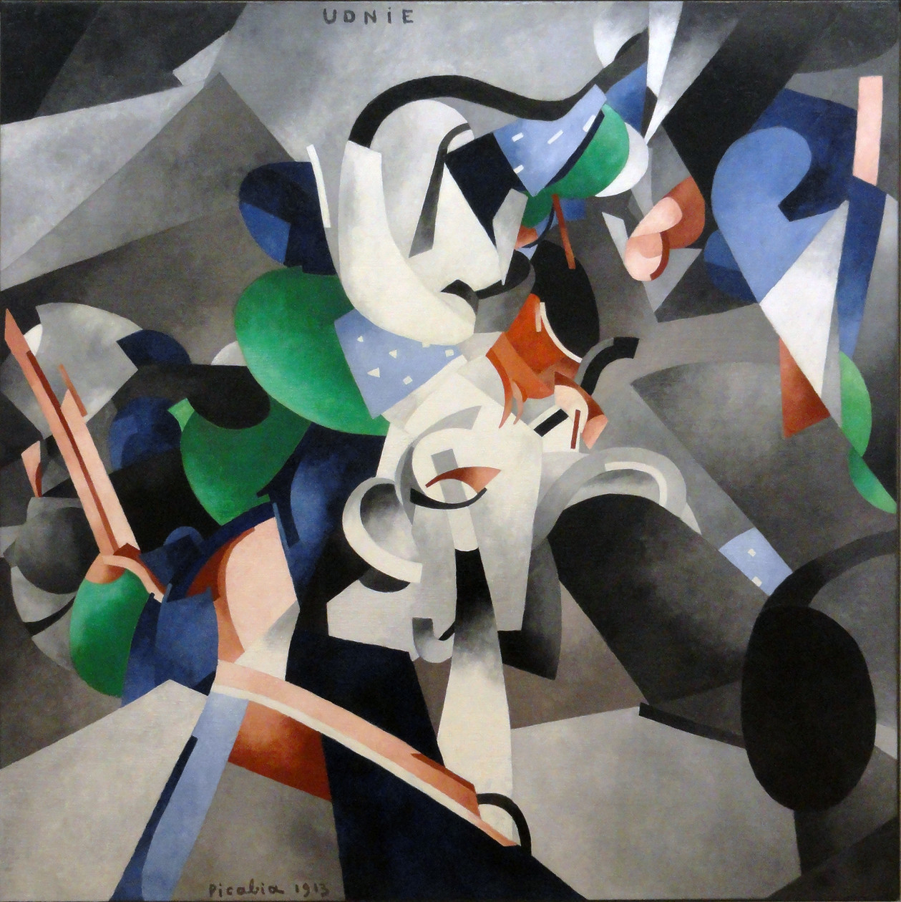
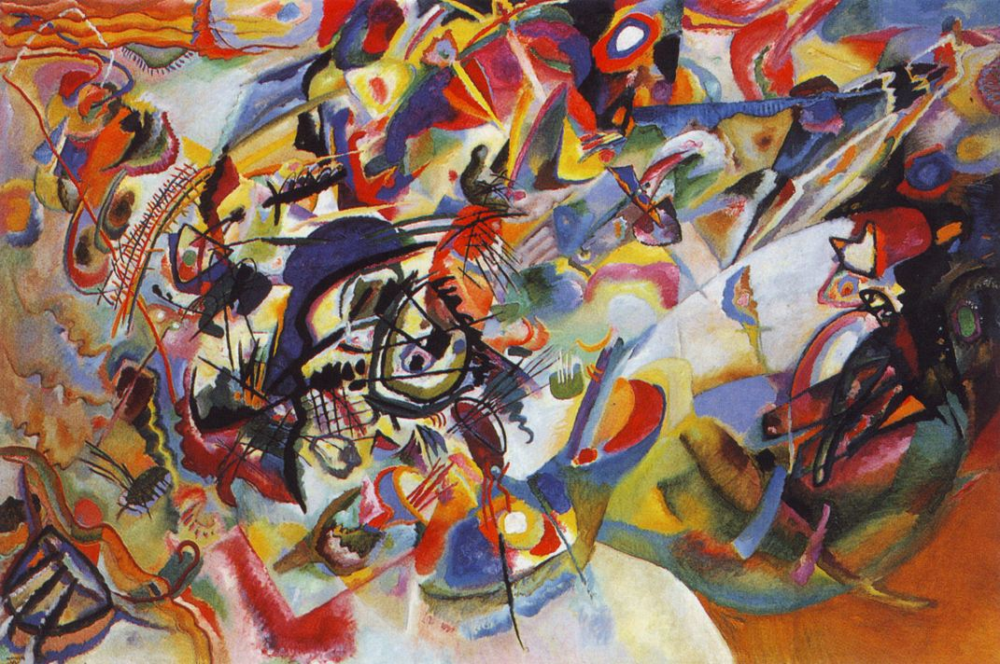
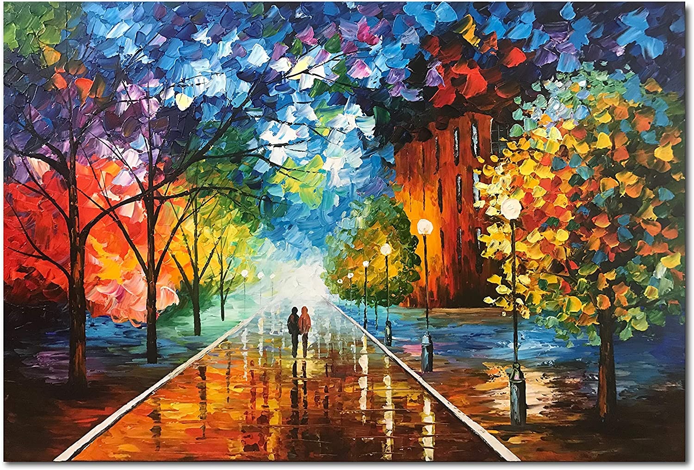

# Fast Neural Style Transfer using Pytorch Models

This repository implements Perceptual Losses for Real-Time Style Transfer and Super-Resolution paper by Justin Johnson, Alexandre Alahi, and Fei-Fei Li, using pretrained VGG models in Pytorch models. Model architecture and training methodology is same, but hyper parameters are different. 

Pretrained models being different the loss function and relative strengths of style loss and content loss needed to be recalibrated. The loss with pretrained models is very small, so scaling it by 1.0e5 works relatively well for different styles.

Was able to replicate results shown in the paper below with pretrained VGG models provided on the Original webpage of the project.

Was able to create similar results with Pretrained Network provided with Pytorch Pretrained model, with different hyper parameters.

1. It will proabably work with other Networks as well like ResNet, might be interesting to see those results.

## Styles used for experiments

1. Style 0

2. Style 1

3. Style 2

4. Style 3

5. Style 4

6. Style 5

7. Style 6

8. Style 7

9. Style 8

10. Style 9

11. Style 10

