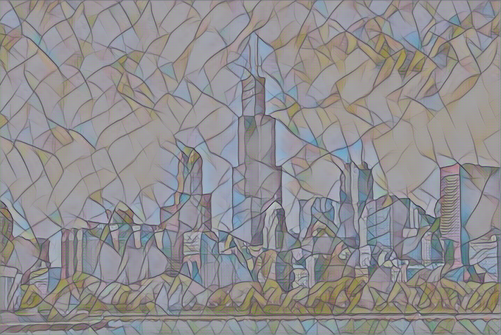
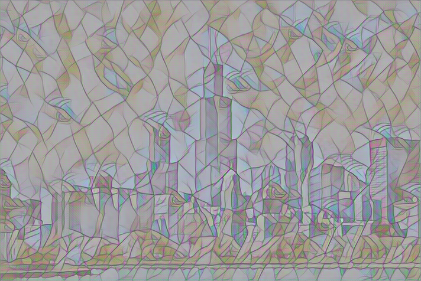
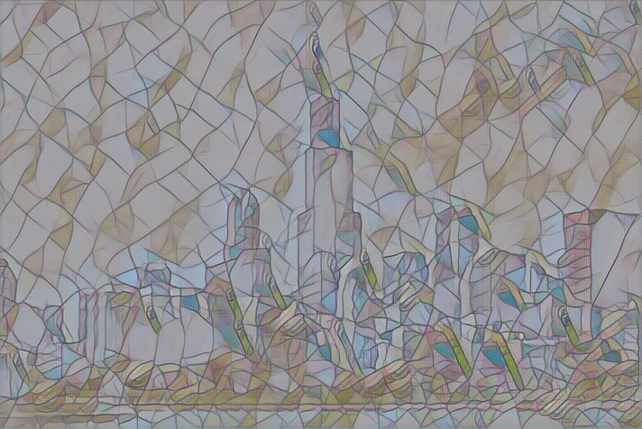
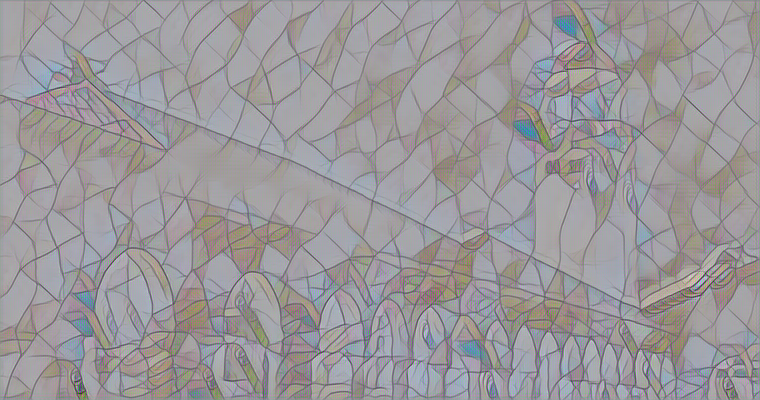
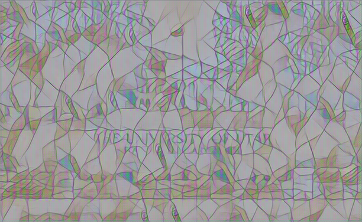
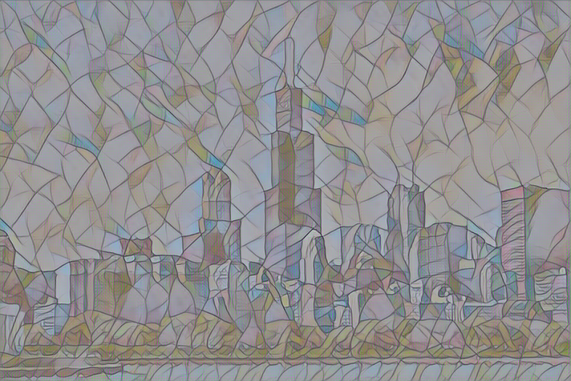

# Results after Training model with different hyper parameters

Learning Rate = 0.001

## Alphatv = 1, Alpha= 200000

## Alphatv = 1, Alpha= 300000

## Alphatv = 1, Alpha= 400000

## Alphatv = 2, Alpha= 500000

